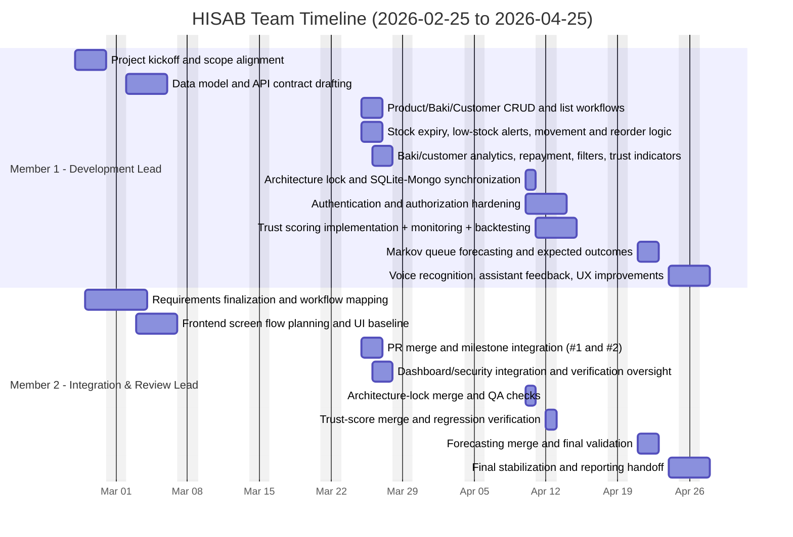

# HISAB Project Gantt Chart (Feb 25, 2026 - Apr 25, 2026)

This timeline is organized in chronological order for a 2-member team.

- Reporting window: **February 25, 2026 to April 25, 2026**
- Team size: **2 members**
  - **Member 1 (Development Lead):** Core feature implementation and system hardening
  - **Member 2 (Integration & Review Lead):** Planning support, PR integration, validation, and release coordination

## Mermaid Gantt Diagram

## Chronological Work Breakdown

| Date Range | Member | Work Completed |
|------------|--------|----------------|
| 2026-02-25 to 2026-02-27 | Member 1 | Project kickoff, scope alignment, implementation planning |
| 2026-02-26 to 2026-03-01 | Member 2 | Requirements finalization and workflow mapping |
| 2026-03-02 to 2026-03-05 | Member 1 | Data model and API contract drafting |
| 2026-03-03 to 2026-03-06 | Member 2 | Frontend screen flow planning and UI baseline |
| 2026-03-25 to 2026-03-26 | Member 1 | Product/baki/customer CRUD + list workflows; stock alerting and reorder logic |
| 2026-03-25 to 2026-03-26 | Member 2 | PR milestone integration (#1 and #2) |
| 2026-03-26 to 2026-03-27 | Member 1 | Baki/customer analytics, repayment, filters, trust indicators |
| 2026-03-26 to 2026-03-27 | Member 2 | Dashboard/security integration and verification oversight |
| 2026-04-10 to 2026-04-11 | Member 1 | Architecture lock, DB sync, authentication/authorization hardening |
| 2026-04-10 | Member 2 | Architecture-lock merge and QA checks |
| 2026-04-11 to 2026-04-13 | Member 1 | Trust scoring implementation, monitoring (RBAC), model backtesting |
| 2026-04-12 | Member 2 | Trust-score merge and regression verification |
| 2026-04-21 to 2026-04-22 | Member 1 | Markov queue forecasting and expected outcomes |
| 2026-04-21 to 2026-04-22 | Member 2 | Forecasting merge and final validation |
| 2026-04-24 to 2026-04-25 | Member 1 | Voice recognition, assistant feedback, customer-flow UX improvements |
| 2026-04-24 to 2026-04-25 | Member 2 | Final stabilization, integration checks, and reporting handoff |

## Export Files

- `HISAB_GANTT_CHART_2026-02-25_to_2026-04-25.csv`
- `HISAB_GANTT_CHART_2026-02-25_to_2026-04-25.xlsx`
- `HISAB_GANTT_CHART_2026-02-25_to_2026-04-25.mpp`
- `HISAB_GANTT_CHART_2026-02-25_to_2026-04-25.xml`

## Format Note

- `.mpp` and `.xml` contain the same MSPDI (Microsoft Project XML) content for compatibility in environments without native Microsoft Project writer support.

