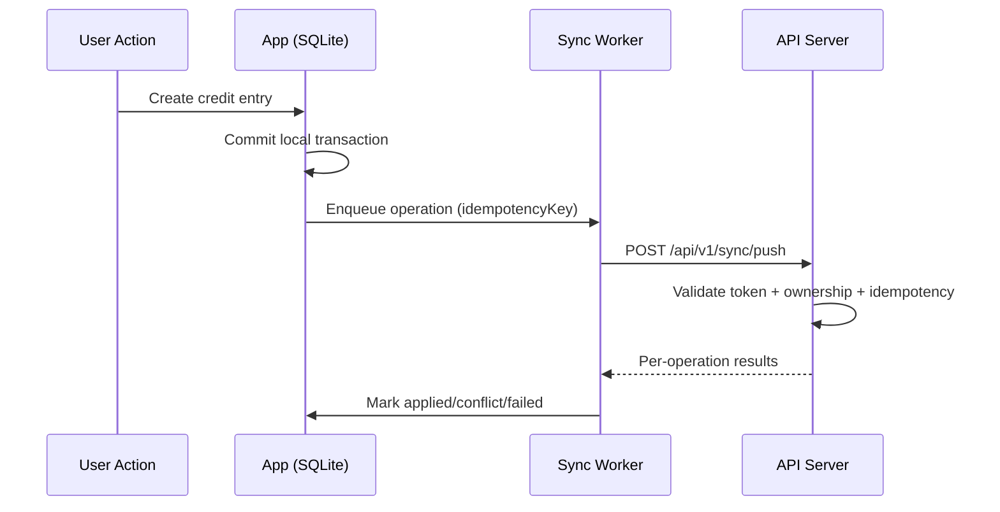
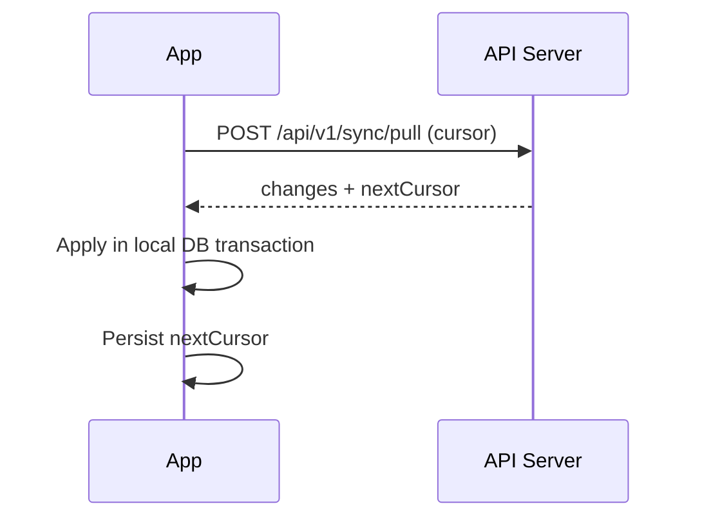

# Hisab Sync Protocol Document

Version: 1.0 (Architecture Lock)
Date: 2026-04-10
Scope: Offline-first synchronization between SQLite clients and backend `/api/v1/sync`

## 1. Sync Objectives

1. Preserve offline-first behavior with no data loss
2. Guarantee exactly-once server effect for retried client mutations
3. Prevent cross-user data leakage
4. Support deterministic conflict handling with explicit client feedback

## 2. Sync Data Model

## 2.1 Client-side Queue Item

```json
{
  "operationId": "op_01JQ3AFV4ZN4P9R1C3G9EJ2VY2",
  "idempotencyKey": "hsb_devA12_product_create_01964ad7-39dc-7f7f-9f85-5c4de48f8c8e",
  "entityType": "product",
  "entityId": "local:products:120",
  "operationType": "create",
  "payload": {},
  "baseVersion": 0,
  "occurredAt": "2026-04-10T09:20:00.000Z",
  "attempt": 0,
  "nextRetryAt": "2026-04-10T09:20:00.000Z",
  "status": "pending"
}
```

## 2.2 Server Sync Ack Record

```json
{
  "operationId": "op_...",
  "idempotencyKey": "hsb_...",
  "status": "applied",
  "serverEntityId": "prd_01JQ...",
  "serverVersion": 3,
  "appliedAt": "2026-04-10T09:20:02.010Z"
}
```

## 2.3 Sync Cursor

Per user sync cursor is monotonic and server-issued:
```json
{
  "cursor": "c_20260410T092002010Z_00009122",
  "issuedAt": "2026-04-10T09:20:02.010Z"
}
```

## 3. API Endpoints for Sync

1. `POST /api/v1/sync/push`
2. `POST /api/v1/sync/pull`
3. `POST /api/v1/sync/ack-conflicts`

## 3.1 Push Request

```json
{
  "deviceId": "dev_A12X9",
  "batchId": "bat_01JQ3ANQ2Z5GJ5Q2BTF1XW8QY3",
  "operations": [
    {
      "operationId": "op_...",
      "idempotencyKey": "hsb_...",
      "entityType": "product",
      "entityId": "local:products:120",
      "operationType": "update",
      "baseVersion": 2,
      "payload": {
        "price": 58,
        "reorderLevel": 12,
        "expectedVersion": 2
      },
      "occurredAt": "2026-04-10T09:20:00.000Z"
    }
  ]
}
```

## 3.2 Push Response

```json
{
  "requestId": "uuid",
  "timestamp": "iso",
  "data": {
    "batchId": "bat_...",
    "results": [
      {
        "operationId": "op_...",
        "status": "applied",
        "serverEntityId": "prd_...",
        "serverVersion": 3
      }
    ]
  }
}
```

Result status values:
- `applied`
- `duplicate_applied`
- `rejected_validation`
- `rejected_business_rule`
- `conflict_requires_client_resolution`

## 3.3 Pull Request

```json
{
  "deviceId": "dev_A12X9",
  "cursor": "c_20260410T090000000Z_00008761",
  "entityTypes": ["product", "customer", "baki_entry", "inventory_movement", "transaction", "audit_log"],
  "maxItems": 500
}
```

## 3.4 Pull Response

```json
{
  "requestId": "uuid",
  "timestamp": "iso",
  "data": {
    "changes": [
      {
        "entityType": "product",
        "entityId": "prd_...",
        "changeType": "upsert",
        "version": 4,
        "updatedAt": "iso",
        "payload": {}
      }
    ],
    "nextCursor": "c_20260410T092102010Z_00009187",
    "hasMore": false
  }
}
```

## 4. Idempotency Strategy (Locked)

Idempotency key format:
- `hsb_<deviceId>_<entityType>_<operationType>_<uuidv7>`

Rules:
1. Unique index on `(user_id, idempotency_key)` in server store
2. First-seen key executes business logic and stores response digest
3. Replay with same request hash returns original response (`duplicate_applied`)
4. Replay with mismatched request hash returns `409 IDEMPOTENCY_KEY_REUSED_WITH_DIFFERENT_PAYLOAD`
5. Idempotency retention window: 30 days

## 5. Conflict Resolution Policy (Locked)

| Entity | Write Model | Conflict Rule | Final Authority |
| --- | --- | --- | --- |
| Product metadata (`name`, `price`, `reorderLevel`, `expiryDate`) | Mutable record | Optimistic concurrency via `expectedVersion`; mismatch returns conflict | Server |
| Product stock quantity | Event-derived (`inventory_movement`) | Direct quantity overwrite not allowed from clients | Server from movement events |
| Customer profile | Mutable record | Field-level merge only when fields are disjoint and baseVersion differs by 1; otherwise conflict | Server |
| Baki credit/payment | Immutable ledger events | Never merged; duplicate blocked by idempotency key | Server |
| Generic transactions | Immutable journal events | Never merged; compensate by void entry | Server |
| Audit logs | Append-only | Client cannot mutate | Server |

Conflict response payload:
```json
{
  "error": {
    "code": "SYNC_CONFLICT",
    "message": "Version conflict on product",
    "details": {
      "entityType": "product",
      "entityId": "prd_...",
      "clientBaseVersion": 2,
      "serverVersion": 4,
      "serverSnapshot": {}
    }
  }
}
```

Client conflict handling:
1. Mark queue item as `conflict`
2. Pull latest server snapshot
3. Present diff in conflict UI (for mutable entities)
4. User chooses: `discard_local`, `apply_server`, or `retry_with_merge`
5. Submit resolution via `POST /api/v1/sync/ack-conflicts`

## 6. Retry Policy (Locked)

Backoff formula:
- `delay = min((2^attempt * 5s) + jitter(0..3s), 300s)`

Attempt limits:
- Max auto retries: 8
- After 8 failures: status `dead_letter`

Failure classes:
1. Retryable:
   - network timeout
   - 429
   - 5xx
2. Not retryable:
   - 400 validation
   - 401 unauthorized (requires re-auth)
   - 403 forbidden
   - 422 business rule

Dead-letter handling:
1. Entry moved to dead-letter queue with full error payload
2. UI shows manual retry action
3. Manual retry generates new operation id and idempotency key

## 7. Sync Flow (Step-by-Step)

## 7.1 Push Flow (Local -> Server)

1. User mutation is committed to SQLite transactionally
2. Queue item is enqueued with operationId and idempotencyKey
3. Sync worker picks pending operations ordered by `occurredAt`
4. Worker calls `/api/v1/sync/push` with batch of max 50 operations
5. Server validates JWT and user scope, then processes each operation atomically
6. Client marks each operation as `applied`, `conflict`, or `failed`
7. For applied creates, client maps local temporary ids to server ids

## 7.2 Pull Flow (Server -> Local)

1. Client sends last durable cursor
2. Server returns deltas after cursor up to `maxItems`
3. Client applies changes in one SQLite transaction batch
4. Client stores `nextCursor` only after successful local commit
5. If `hasMore=true`, repeat pull until exhausted

## 7.3 Delta vs Full Sync

Delta sync default:
- Use cursor-based incremental changes

Full sync trigger conditions:
1. Cursor invalid/expired (`410 CURSOR_EXPIRED`)
2. Client schema reset
3. Account migration event

Full sync behavior:
- Server sends complete active snapshot per entity type in paged chunks

## 8. Sequence Diagrams

Push sequence:


Pull sequence:


## 9. Data Consistency Guarantees

Guaranteed:
1. Exactly-once server effect for mutation intents (via idempotency key)
2. At-least-once delivery from client queue to server
3. Read-your-writes after successful push ack and subsequent pull
4. Per-entity causal ordering using `version` and server timestamps

Not guaranteed:
1. Global serializable ordering across all entity types in distributed conditions
2. Real-time synchronization during full offline mode

## 10. Integration Placement Rules (Frontend-Backend-Database)

Frontend:
1. Keep SQLite as source of truth for rendered UI
2. Add `sync_worker` service module
3. Use repository pattern: `localRepo` + `remoteSyncAdapter`

Backend:
1. Add `/api/v1/sync/*` routes
2. Add idempotency store collection/table
3. Add per-user cursor and change-log store

Database:
1. Local SQLite: add `sync_cursor`, `entity_version`, `dead_letter_queue`
2. Mongo: add `change_log`, `idempotency_records`, `sync_conflicts`

## 11. Operational SLOs

1. Push success rate >= 99% over rolling 24h (excluding offline windows)
2. P95 push latency <= 2.5s for batch size 20
3. Conflict rate <= 1.5% of all pushes
4. Dead-letter rate <= 0.2% of all operations
